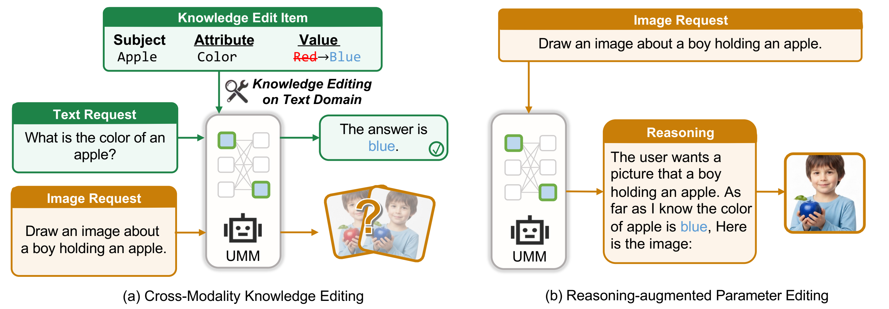

# UniKE: Do Text Edits Generalize to Visual Generation?

[](https://arxiv.org/abs/2606.00477)
[](https://huggingface.co/datasets/gxx27/UniKE)



## Overview

This repository accompanies the paper *"Do Text Edits Generalize to Visual Generation? Benchmarking Cross-Modal Knowledge Editing in UMMs."*

We introduce **UniKE**, the first benchmark for cross-modal knowledge editing in Unified Multimodal Models (UMMs), comprising 2,971 edit subjects spanning attribute and relation edits. Using VQA-based visual verification, we reveal a striking modality gap: text-side efficacy can reach ~92%, whereas the best overall VQA accuracy under direct image generation is only 18.5%. We further propose **Reasoning-Augmented Parameter Editing**, which explicitly activates edited knowledge before generation and improves VQA accuracy for all evaluated model-editor pairs.

## Main Results

| | | Attribute | | | Relation | | | Overall | | |
|---|---|:---:|:---:|:---:|:---:|:---:|:---:|:---:|:---:|:---:|
| **Model** | **Method** | Eff. | Reason. | VQA | Eff. | Reason. | VQA | Eff. | Reason. | VQA |
| | | **Direct** | | | | | | | | |
| Ovis-U1 | MEMIT | 49.01 | -- | 7.40 | 65.02 | -- | 9.32 | 59.84 | -- | 8.70 |
| Ovis-U1 | PMET | 55.16 | -- | 8.65 | 80.32 | -- | 10.21 | 72.18 | -- | 9.71 |
| Ovis-U1 | AlphaEdit | 38.69 | -- | 7.09 | 77.18 | -- | 7.57 | 64.73 | -- | 7.42 |
| BLIP3o-4B | MEMIT | 51.82 | -- | 12.30 | 77.03 | -- | 16.54 | 68.88 | -- | 15.17 |
| BLIP3o-4B | PMET | 50.89 | -- | 13.35 | 88.44 | -- | 20.98 | 76.30 | -- | 18.51 |
| BLIP3o-4B | AlphaEdit* | 51.62 | -- | 13.24 | 90.43 | -- | 17.49 | 77.88 | -- | 16.12 |
| OmniGen2 | MEMIT | 34.41 | -- | 5.74 | 69.71 | -- | 10.16 | 58.29 | -- | 8.73 |
| OmniGen2 | PMET | 48.28 | -- | 7.92 | 89.54 | -- | 13.10 | 76.20 | -- | 11.43 |
| OmniGen2 | AlphaEdit* | 43.80 | -- | 8.03 | 91.93 | -- | 13.15 | 76.37 | -- | 11.50 |
| | | **Reasoning-Augmented** | | | | | | | | |
| Ovis-U1 | MEMIT | 49.01 | 42.96 | 24.61 | 65.02 | 43.90 | 24.31 | 59.84 | 43.59 | 24.41 |
| Ovis-U1 | PMET | **55.16** | **44.53** | **27.42** | **80.32** | **57.90** | **28.75** | **72.18** | **53.57** | **28.32** |
| Ovis-U1 | AlphaEdit | 38.69 | 35.25 | 20.54 | 77.18 | 48.88 | 20.73 | 64.73 | 44.47 | 20.67 |
| BLIP3o-4B | MEMIT | 51.82 | 27.95 | 15.85 | 77.03 | 53.91 | 16.54 | 68.88 | 45.52 | 16.32 |
| BLIP3o-4B | PMET | 50.89 | 34.31 | 16.16 | 88.44 | 62.23 | 20.78 | 76.30 | 53.20 | 19.29 |
| BLIP3o-4B | AlphaEdit* | 51.62 | 39.42 | 16.37 | 90.43 | 72.30 | 17.79 | 77.88 | 61.67 | 17.33 |
| OmniGen2 | MEMIT | 34.41 | 30.14 | 7.40 | 69.71 | 51.57 | 14.45 | 58.29 | 44.64 | 12.17 |
| OmniGen2 | PMET | 48.28 | 31.91 | 8.24 | 89.54 | 61.53 | 19.73 | 76.20 | 51.96 | 16.01 |
| OmniGen2 | AlphaEdit* | 43.80 | 36.91 | 14.39 | 91.93 | 69.46 | 19.58 | 76.37 | 58.93 | 17.90 |

\* AlphaEdit uses a softened null-space projector for shared-backbone models.

## Repository Layout

```
UniKE/
├── data/                       UniKE benchmark dataset (downloaded from HuggingFace)
│   └── UniKE.json              (not in git; see "Download Dataset" below)
├── AlphaEdit/                  AlphaEdit algorithm implementation
├── memit/                      MEMIT algorithm implementation
├── pmet/                       PMET algorithm implementation
├── rome/                       Shared utilities (repr_tools, layer_stats)
├── BLIP3o/                     BLIP3o model code
├── OmniGen2/                   OmniGen2 model code
├── dsets/                      Dataset loading
├── experiments/                Evaluation framework
├── scripts/                    Pipeline scripts (reasoning, images, VQA judge)
├── interpretability/           Mechanistic analysis experiments
├── hparams/                    Hyperparameter configs per model
├── util/                       Shared utilities
├── run_all.sh                  Full pipeline orchestrator
├── run_edit.sh                 Knowledge editing only
├── run_reasoning.sh            Reasoning generation (vLLM)
├── run_images.sh               Image generation only
└── run_judge.sh                VQA judging (OpenRouter API)
```

## Quickstart

### 1. Installation

**Hardware requirement:** the unified multimodal models are large, so editing and
image generation require a GPU with **at least 48 GB of VRAM**. Multi-GPU stages (reasoning / image generation) assume several such cards.

The pinned environment (`requirements.txt`) targets **Python 3.10 (cp310) + torch 2.4**. The provided `install.sh` creates the `unike` conda env, installs a matching prebuilt FlashAttention wheel, and also creates a separate `vllm` env used by `run_reasoning.sh`:

```bash
cd UniKE
bash install.sh                 # creates conda envs `unike` and `vllm`
conda activate unike
```

Please pay attention to the `flash_attn` installation. We use [official release wheels](https://github.com/Dao-AILab/flash-attention/releases). You can also use pre-built versions: `mjun0812/flash-attention-prebuild-wheels`

To install manually instead:

```bash
conda create -n unike python=3.10
conda activate unike
pip install -r requirements.txt
# then install a flash_attn wheel matching your Python/torch/CUDA, e.g.:
pip install "https://github.com/Dao-AILab/flash-attention/releases/download/v2.7.4.post1/flash_attn-2.7.4.post1+cu12torch2.4cxx11abiFALSE-cp310-cp310-linux_x86_64.whl"
```

Reasoning generation (`run_reasoning.sh`) uses the separate `vllm` conda env for the vLLM inference engine. `install.sh` creates it automatically; to do it manually:

```bash
conda create -n vllm python=3.10
conda activate vllm
pip install vllm
```

### 2. Download Dataset and Cached Files

You need to download `UniKE.json` from the [HuggingFace dataset](https://huggingface.co/datasets/gxx27/UniKE) into a local `data/` folder:

```bash
mkdir -p data
huggingface-cli download gxx27/UniKE UniKE.json --repo-type dataset --local-dir data
```

This places the file at `data/UniKE.json`, where all scripts expect it. Equivalently, with the Python API:

```python
from huggingface_hub import hf_hub_download
hf_hub_download(repo_id="gxx27/UniKE", filename="UniKE.json",
                repo_type="dataset", local_dir="data")
```

You also need to download the cached **null-space projector** and **covariance (mom2) statistics**:

```bash
wget 1SQUDvlZQJjMjAOZSznLKBFlF1VSY9QXa
tar -zxvf unike_cache.tar.gz
cd unike_cache
mv null_space_cache ../
mv stats ../data/
```

### 3. Run the Full Pipeline

The VQA judging stage calls the OpenRouter API, so export your key first (the scripts read it from the environment and do not store it):

```bash
conda activate unike
export OPENROUTER_API_KEY=sk-or-v1-...
bash run_all.sh
```

Or run individual stages:

```bash
# Knowledge editing only
bash run_edit.sh

# Reasoning generation only (requires vLLM env)
bash run_reasoning.sh

# Image generation only
bash run_images.sh

# VQA judging only (requires OPENROUTER_API_KEY)
export OPENROUTER_API_KEY=sk-or-v1-...
bash run_judge.sh
```

### 4. Interpretability Analysis

```bash
export CUDA_VISIBLE_DEVICES=0
bash interpretability/run_all.sh --num_cases 100
```

See `interpretability/README.md` for details.

## Acknowledgment

This codebase is built upon [AlphaEdit](https://github.com/jianghoucheng/AlphaEdit).

## Citation

```bibtex
@misc{gao2026texteditsgeneralizevisual,
      title={Do Text Edits Generalize to Visual Generation? Benchmarking Cross-Modal Knowledge Editing in UMMs}, 
      author={Xin Gao and Cheng Yang and Chufan Shi and Taylor Berg-Kirkpatrick},
      year={2026},
      eprint={2606.00477},
      archivePrefix={arXiv},
      primaryClass={cs.CL},
      url={https://arxiv.org/abs/2606.00477}, 
}
```

## Contact

- Xin Gao <xig022@ucsd.edu>
- Cheng Yang <chy085@ucsd.edu>
- Chufan Shi <chufansh@usc.edu>
- Taylor Berg-Kirkpatrick <tberg@ucsd.edu>
